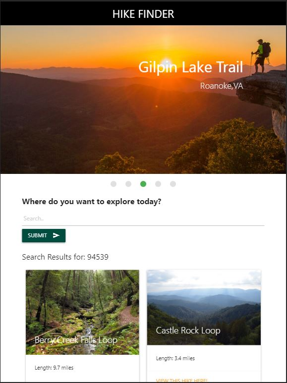

# **Explore: Explore the world one Hike at a Time with HIKE FINDER**

## **Purpose**
During times of social distancing, it is important for people to take advantage of things that still remain open, such as the outdoors, and more specifically - hiking. HIKE FINDER provides the user with a one stop shop for everything they need to know to prepare for their next adventure. 

## **Features** 
HIKE FINDER is an easy to use mobile friendly website that allows the user to find a hike in a location of their choosing by zip code, or even a specific hike name. Users can see important details about the hike such as length, altitude, weather conditions, ratings, and more. Users are also presented with a gear checklist allowing them to determine necessary preparation, including whether to take advantage of the handy storefinder feature! HIKE FINDER provides a list of sporting good stores near the user's hike or another desired location to help the user ensure they have everything they need.

## Built With
* HTML
* CSS
* JavaScript
* Materialize
* Web APIs
* Server-Side APIs

## Website
https://jennifermulder.github.io/explore/

## Project Status
First phase

## Planned Enhancements
User's ability to add the searched hike to a personal list of saved hikes with local storage
Also the user can decide the difficulty of the walk that he wants to do, per example: length, 
altitude, weather conditions, ratings, and more...

## Contribution
Created by Nathan McAnally, Mario Viana, Jennifer Mulder, and Sparsh Patwa
